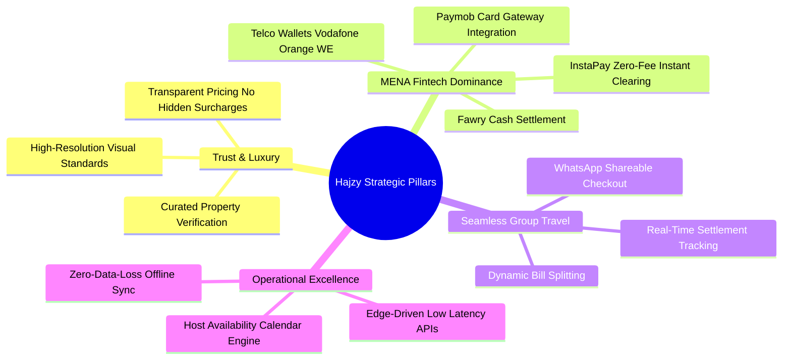
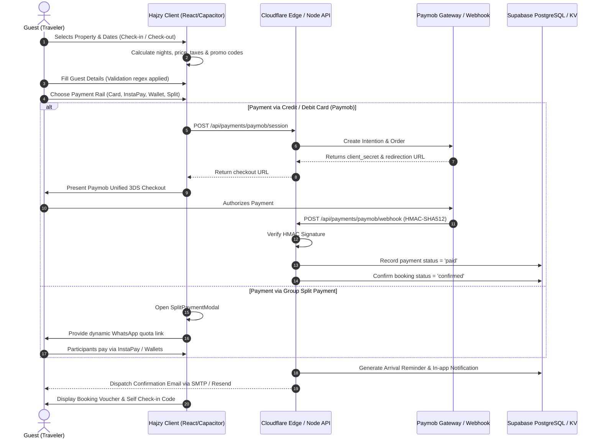
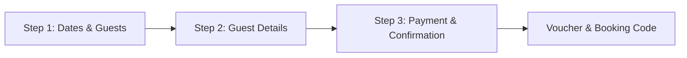
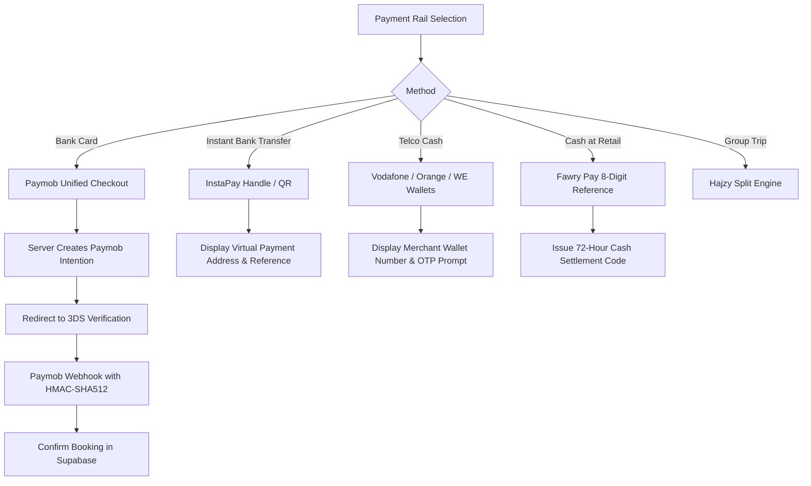
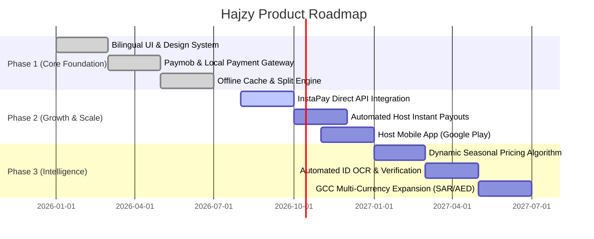

# Product Requirements Document (PRD)

# Hajzy (حجزي) – Premium Vacation Rental & Luxury Hospitality Platform

---

| **Document Metadata** | **Details** |
| :--- | :--- |
| **Product Name** | **Hajzy** (حجزي) |
| **Document Version** | **2.0.0 (Production-Ready Architecture)** |
| **Author** | Antigravity Product & Systems Architecture Team |
| **Status** | **Approved / Active Implementation** |
| **Target Platform** | Web (Responsive Desktop & Mobile), Android (Capacitor), Cloudflare Edge, Node.js Backend |
| **Primary Region** | Egypt & MENA Region (Expanding to GCC) |
| **Supported Languages** | Bilingual: Arabic (RTL, Primary) & English (LTR) |

---

## Table of Contents

1. [Executive Summary & Vision](#1-executive-summary--vision)
2. [Strategic Goals & Business Objectives](#2-strategic-goals--business-objectives)
3. [User Personas & Target Market](#3-user-personas--target-market)
4. [User Journeys & Workflow Diagrams](#4-user-journeys--workflow-diagrams)
5. [Feature Specifications & Functional Requirements](#5-feature-specifications--functional-requirements)
   - 5.1 Authentication, Onboarding & Security
   - 5.2 Property Discovery, Search & Map Exploration
   - 5.3 Property Details, Interactive Gallery & Neighborhood Insights
   - 5.4 High-Conversion Multi-Step Reservation Engine
   - 5.5 Egyptian & Regional Fintech Payment Architecture
   - 5.6 Group Booking: Dynamic Split Payment Engine
   - 5.7 AI Travel Concierge
   - 5.8 In-App Host-Guest Chat & Messaging
   - 5.9 Host Management Dashboard & Availability Calendar
   - 5.10 User Profile, Wishlists & Multi-Channel Notifications
6. [Non-Functional Requirements (NFRs)](#6-non-functional-requirements-nfrs)
   - 6.1 Performance & Core Web Vitals
   - 6.2 Security, Cryptography & Compliance
   - 6.3 Offline Resilience & Data Integrity
   - 6.4 Internationalization & RTL-First UI
7. [System Architecture & Technology Stack](#7-system-architecture--technology-stack)
   - 7.1 Architecture Diagram
   - 7.2 Technology Matrix
   - 7.3 API Endpoints Specification
   - 7.4 Database Schema & RLS Security Policies
8. [Design System & Aesthetics Guidelines](#8-design-system--aesthetics-guidelines)
9. [Release Phases, Roadmap & Success Metrics (KPIs)](#9-release-phases-roadmap--success-metrics-kpis)

---

## 1. Executive Summary & Vision

### 1.1 Product Statement
**Hajzy** (حجزي - *"My Reservation"*) is a tier-1 boutique vacation rental and luxury hospitality platform tailored specifically for the distinctive demands of Egypt and the broader MENA market. While global platforms (e.g., Airbnb, Booking.com) offer standardized cross-border interfaces, they often fail to address localized domestic realities: hyper-local payment rails (InstaPay, Vodafone Cash, Fawry), group vacation dynamics requiring friction-free cost splitting, WhatsApp-first customer communication, and native right-to-left (RTL) aesthetic sophistication.

### 1.2 Core Value Proposition
- **Curated Luxury Inventory:** High-trust verification for premier coastal chalets, historic villas, and modern urban residences in Alexandria, Cairo, Giza, Hurghada, Sharm El-Sheikh, and El Gouna.
- **MENA-Native Fintech:** Native processing via Paymob (Visa/Mastercard 3D Secure), instantaneous bank transfers via InstaPay QR, Egyptian Mobile Wallets, and cash vouchers via Fawry.
- **Social Bill Splitting:** An integrated group payment calculator providing shareable deep-links and progress bars so travel companions can pay their quota directly.
- **AI-Powered Local Concierge:** Contextual AI assistant delivering verified neighborhood insights, self-check-in digital lock instructions, and emergency services.
- **Cross-Platform & Offline-Resilient:** Hybrid React 19 Progressive Web App running natively on Android through Capacitor with haptic feedback, native sharing, and an offline booking cache.

---

## 2. Strategic Goals & Business Objectives



1. **Target Conversion Rate:** Achieve an industry-leading checkout completion rate exceeding 18% (compared to the regional benchmark of 9-11%) by eliminating cross-border card restrictions through local wallets and InstaPay.
2. **Time to Confirm:** Reduce property booking and confirmation turnaround to under 60 seconds with instant booking and automated SMS/Email receipts.
3. **Platform Trust:** Zero double-booking errors achieved through transactional database locking and real-time host calendar controls.

---

## 3. User Personas & Target Market

### Persona A: The Luxury Weekend Vacationer (Guest)
* **Demographics:** Egyptian or Gulf professional, aged 26–45, traveling with family or close friends.
* **Behaviors:** Books private chalets in El Gouna or North Coast for weekends and holidays.
* **Pain Points:** Distrusts unverified social media listings; encounters foreign transaction fees on international platforms; struggles to collect shares of the rental cost from friends.
* **Hajzy Solution:** Verified badges, authentic photographic tours, InstaPay integration, and the Hajzy Split Payment system.

### Persona B: The Group Organizer / Trip Planner (Guest)
* **Demographics:** University student or young professional organizing a friends' getaway.
* **Behaviors:** Coordinates logistics, negotiates dates, and manages finances on WhatsApp.
* **Pain Points:** Having to front the full cost of a 30,000 EGP villa and chasing friends for reimbursement over weeks.
* **Hajzy Solution:** Generates a single split link sent to the WhatsApp group, where each friend pays their quota with instant status updates.

### Persona C: The Boutique Property Owner / Superhost (Host)
* **Demographics:** Real-estate investor owning 2–10 high-value holiday units in Cairo or Red Sea destinations.
* **Behaviors:** Currently relies on property managers or fragmented classified ads; demands transparent calendars and direct guest communication.
* **Pain Points:** High commission cuts from international aggregators (15-20%); complex payout cycles to Egyptian bank accounts.
* **Hajzy Solution:** Lower platform fee (3-7%), direct host analytics dashboard, granular calendar blackouts, and local currency payouts.

---

## 4. User Journeys & Workflow Diagrams

### 4.1 Guest Reservation & Payment Flow



---

## 5. Feature Specifications & Functional Requirements

### 5.1 Authentication, Onboarding & Security

| Feature Code | Requirement Title | Detailed Specification | Acceptance Criteria |
| :--- | :--- | :--- | :--- |
| **AUTH-01** | Dual Email / Password Registration | Secure signup requiring Full Name, Email, and minimum 8-character password. Server applies PBKDF2 with 100,000 iterations and salt or bcrypt hashing. | Form validation rejects passwords < 8 chars or malformed emails. Duplicate emails return HTTP 409 Conflict. |
| **AUTH-02** | Email Verification Lifecycle | Automated cryptographic 32-byte token generated upon registration; dispatches high-aesthetic RTL email with deep-link (`/verify-email?token=...`). | Token marked verified in database; unverified users restricted according to platform configuration. |
| **AUTH-03** | Password Recovery Engine | Self-service forgot password mechanism generating 30-minute expiring tokens. Custom HTML email delivered via Gmail TLS Socket or Resend API. | Non-existent emails yield a helpful notification; valid links load `ResetPasswordPage` and invalidate used tokens immediately. |
| **AUTH-04** | Frictionless Guest Mode | First-time visitors can browse, filter, explore maps, and assemble cart without forced registration until the final checkout or favorite action. | `localStorage.getItem('hajzy_guest_mode')` preserves session state without authentication road-blocks. |
| **AUTH-05** | Native & Web Social Login | Integration with Google Sign-In and Apple Authentication using `@capgo/capacitor-social-login` on Android/iOS and OAuth 2.0 modals on web. | Profile data (name, email, avatar) is ingested and mapped to the `profiles` table seamlessly. |

---

### 5.2 Property Discovery, Search & Map Exploration

| Feature Code | Requirement Title | Detailed Specification | Acceptance Criteria |
| :--- | :--- | :--- | :--- |
| **DISC-01** | Multi-City Hubs | High-resolution curated destinations: Alexandria, Cairo, Giza, Hurghada, Sharm El-Sheikh, and El Gouna with localized metadata (Arabic & English). | Switching city filters properties instantaneously; URL query params or city slugs update smoothly. |
| **DISC-02** | Multi-Parameter Filter Engine | Search by property type (Villa, Penthouse, Chalet, Studio), price-per-night sliders, star ratings (4.5+), and essential amenities (Pool, Sea View, Fast WiFi, Smart Lock). | Filter results update dynamically with zero layout shifts; active badge counter highlights applied filters. |
| **DISC-03** | Geolocation Map View | Interactive Leaflet map with custom SVG price markers, pin clustering, and responsive preview drawer on mobile. | Panning map centers nearby listings; clicking a price badge triggers active card highlight and auto-scroll. |
| **DISC-04** | Photo Sanitization Engine | Custom URI sanitizer (`sanitizePhotoUrl`) detecting deprecated CDN paths and substituting high-fidelity Unsplash architectural fallbacks. | Zero broken image icons or missing asset placeholders across any listing card. |

---

### 5.3 Property Details, Interactive Gallery & Neighborhood Insights

| Feature Code | Requirement Title | Detailed Specification | Acceptance Criteria |
| :--- | :--- | :--- | :--- |
| **PROP-01** | Fullscreen Media Gallery | Immersive modal lightbox (`PropertyGalleryModal`) with keyboard arrow navigation, swipe gestures, and thumbnail ribbons. | Opens smoothly on image click; supports full image aspect ratios without distortion; accessible close button. |
| **PROP-02** | Verified Neighborhood Guide | Dedicated component (`NeighborhoodExplorer`) outlining walkability scores, nearby supermarkets, pharmacies, beach access points, and ATM locations. | Accurately reflects destination-specific landmarks (e.g., Abu Tig Marina in Gouna; Stanley Bridge in Alex). |
| **PROP-03** | Transparent Pricing Matrix | Nightly rate calculation with dynamic breakdown: Base Rate × Nights + One-time Cleaning Fee + Service Fee (0% during promo) - Discount Code. | All monetary values formatted using `tabular-nums` and localized currency formatting (`EGP` / `ج.م`). |

---

### 5.4 High-Conversion Multi-Step Reservation Engine



- **Step 1: Dates & Occupancy Selection:**
  - Date picker with automatic `checkIn` (tomorrow) and `checkOut` (day after tomorrow) defaults.
  - Automatic validation preventing past-date selection or reservations where checkout precedes checkin.
  - Headcount selector adjusting guest count with property capacity boundary limits.
- **Step 2: Contact Information Validation:**
  - Strict validation using `bookingValidation.js`:
    - Full Name: Minimum 3 letters, alphabetic only.
    - Phone Number: Automatic normalization of Egyptian formats (`010...`, `011...`, `012...`, `015...`) converting to standardized E.164 (`+201XXXXXXXXX`).
    - Email Address: Standard RFC compliance validation.
  - Session storage auto-save prevents data loss on accidental browser refreshes.
- **Step 3: Payment Method Selection & Promo Engine:**
  - Real-time coupon validation (`SUMMER2026`, `WELCOME10`, etc.) supporting flat reductions or percentages.
  - Granular selection between Credit/Debit Card, InstaPay, Mobile Wallet, Fawry, or Split Payment.

---

### 5.5 Egyptian & Regional Fintech Payment Architecture

Hajzy delivers deep integration with Egyptian financial infrastructure:



1. **Paymob Integration:**
   - Server-side intention creation endpoint `/v1/intention/` using API keys configured in environment secrets.
   - Webhook security using `crypto.subtle.importKey('raw', secret, { name: 'HMAC', hash: 'SHA-512' })` verifying HMAC signatures across 19 standard transaction fields before updating booking records.
2. **InstaPay Integration:**
   - Real-time display of official merchant IPA (Instant Payment Address: `hajzy@instapay`).
   - Integrated QR generator enabling instant mobile camera scanning.
3. **Fawry Pay:**
   - Issuance of an 8-digit transaction reference number valid for 48 hours at over 180,000 retail kiosks across Egypt.

---

### 5.6 Group Booking: Dynamic Split Payment Engine

The `SplitPaymentModal` solves the primary friction point in Egyptian group and family holidays:
- **Participant Slider:** Allows dynamic division among 2 to 12 companions.
- **Real-Time Calculation:** Computes exact individual quota (`Math.ceil(totalAmount / splitCount)`).
- **Progressive Tracking:** Interactive progress ring and bar showing collected funds vs. pending dues.
- **Viral Sharing Hooks:**
  - One-tap WhatsApp generator with pre-filled message:
    > *"مرحباً! هذا رابط دفع حصتك في حجز [اسم العقار] عبر منصة حجزي بقيمة [المبلغ] ج.م: [رابط الدفع]"*
  - Native Web Share API trigger (`useNativeShare`) with automatic clipboard fallback.

---

### 5.7 AI Travel Concierge

The in-app AI Concierge (`AiConciergeModal`) functions as a 24/7 personal hospitality butler:
- **Destination Knowledge Base:** Pre-configured with local curation for Cairo, Alexandria, Hurghada, Gouna, and Sharm El-Sheikh.
- **Intelligent Response System:**
  - Categorizes inquiries into Dining, Nightlife, Water Sports, Emergencies/Pharmacies, and Self Check-in Guide.
  - Generates responses in the user's active language (Arabic or English).
- **Interactive Quick Chips:** Suggested query buttons enabling rapid one-tap inquiries on mobile screens without typing.

---

### 5.8 In-App Host-Guest Chat & Messaging

- **Direct Communication:** Thread-bound chat room (`ChatPage`) associated with each property ID.
- **Real-Time Synchronization:** Instant updates backed by Supabase Realtime subscriptions with fallback polling.
- **Contextual Badges:** Displays guest stay dates, check-in status, and quick automated responses (e.g., *"Is early check-in available?"*).

---

### 5.9 Host Management Dashboard & Availability Calendar

The platform features a dedicated portal for property owners (`DashboardPage` & `HostCalendar`):
- **Performance Analytics:** Visual cards tracking Total Revenue (EGP), Active Bookings, Occupancy Rate (%), and Average Guest Rating.
- **Inventory Control:** Comprehensive CRUD suite (Create, Read, Update, Delete) for property listings with image URL arrays, amenity checklists, and nightly price controls.
- **Host Availability Calendar:**
  - Interactive grid displaying days of the current and future months.
  - Instant toggle to mark dates as "Reserved", "Blocked for Maintenance", or "Available".
  - Date-specific nightly rate overrides for peak holiday seasons (e.g., Eid, New Year's Eve).

---

### 5.10 User Profile, Wishlists & Multi-Channel Notifications

- **Profile Center:** User details management, password change with old-password verification, and avatar upload.
- **Persistent Wishlist:** Instant toggle heart icon on any card; synched directly to the `favorites` table via authenticated UUIDs.
- **Notification Center:**
  - Category types: `booking`, `payment`, `reminder`, `system`.
  - Automated 24-hour pre-arrival reminder trigger (`checkAndGenerateArrivalReminders`).
  - Bilingual notification text storage with automatic badge count synchronization.

---

## 6. Non-Functional Requirements (NFRs)

### 6.1 Performance & Core Web Vitals
- **Largest Contentful Paint (LCP):** Under 1.8 seconds on standard 4G mobile connections.
- **First Input Delay (FID) / Interaction to Next Paint (INP):** Under 50 milliseconds; interactive elements provide immediate haptic or visual micro-feedback.
- **Cumulative Layout Shift (CLS):** Zero (0.00) through skeleton loading placeholders (`LuxuryPageSkeleton`) and pre-dimensioned image aspect ratios.
- **Bundle Optimization:** Route-level code splitting using `React.lazy()` and `Suspense` for heavy auxiliary views (`ChatPage`, `DashboardPage`, `MarketingPage`).

### 6.2 Security, Cryptography & Compliance
- **Authentication Credentials:** Passwords hashed with PBKDF2 (100,000 rounds, SHA-256) or bcrypt. Plaintext passwords never logged.
- **Token Security:** JWT tokens signed with HMAC-SHA256 with 7-day expiration; production enforces high-entropy random secrets.
- **Transport Layer Security:** Strict HTTPS enforcement with HSTS headers via Cloudflare Edge.
- **Row-Level Security (RLS):** All Supabase database tables have RLS enabled. Guests can only query their own bookings; hosts can only access bookings associated with properties they own.
- **PCI-DSS Compliance:** Hajzy never stores or processes raw credit card numbers; payment data is transmitted directly to Paymob's PCI-DSS Level 1 certified vault.

### 6.3 Offline Resilience & Data Integrity
- **Offline Booking Cache:** Leverages the `useOfflineBooking` hook to cache intent in `localStorage`/`IndexedDB` during intermittent mobile network loss, synchronizing automatically when connectivity resumes.
- **Seed Fallback Engine:** If cloud database connectivity is disrupted, the client transparently falls back to verified seed data (`propertySeed`) so browsing and searching never break.

### 6.4 Internationalization & RTL-First UI
- **Bi-Directional Engine:** Integrated `i18next` framework switching between Arabic (`ar`, RTL) and English (`en`, LTR) without page reload.
- **Typography Pairing:**
  - Arabic: Modern, legible typography via `Cairo` and `Tajawal`.
  - English & Numbers: Precision geometric typefaces via `Inter` and `Poppins`.
- **Mirroring Standards:** Icons, chevrons, forms, and navigation drawer animations mirror accurately according to `document.dir`.

---

## 7. System Architecture & Technology Stack

### 7.1 Architecture Diagram

```
                      +---------------------------------------+
                      |   Client Application (PWA / Mobile)   |
                      |  React 19 + Tailwind CSS v4 + Vite    |
                      |  Capacitor v8 Android Native Shell   |
                      +-------------------+-------------------+
                                          |
                        HTTPS / JSON REST | WebSocket
                                          v
                      +---------------------------------------+
                      |       Edge & API Gateway Tier         |
                      |     Cloudflare Pages Functions        |
                      |    (functions/api/[[path]].js)        |
                      +-------------------+-------------------+
                                          |
             +----------------------------+----------------------------+
             |                                                         |
             v                                                         v
+--------------------------+                              +--------------------------+
|   Data & Storage Tier    |                              |   Third-Party Services   |
| Supabase PostgreSQL (RLS)|                              | Paymob Payment Gateway   |
| Cloudflare KV Store      |                              | Resend / Gmail SMTP      |
| Leaflet OpenStreetMap    |                              | Capacitor Social OAuth   |
+--------------------------+                              +--------------------------+
```

### 7.2 Technology Matrix

| Layer | Technology | Justification |
| :--- | :--- | :--- |
| **Frontend Framework** | **React 19** | Ultra-responsive state management, concurrent rendering, and hooks architecture. |
| **Build Tool** | **Vite 8** | Lightning-fast Hot Module Replacement (HMR) and optimized rollup production bundles. |
| **Styling & Design** | **Tailwind CSS v4 + Vanilla Tokens** | High-speed utility styling combined with strict CSS custom variables for dark/light themes. |
| **Mobile Runtime** | **Capacitor v8 (`@capacitor/android`)** | Native Android execution, hardware haptics (`useHaptics`), and system sharing dialogs. |
| **Database** | **Supabase (PostgreSQL 15+)** | Enterprise relational data model, native Row-Level Security (RLS), and JSONB support. |
| **Edge Hosting** | **Cloudflare Pages & Workers** | Distributed edge functions (`[[path]].js`) ensuring sub-50ms API latency across MENA. |
| **Email Gateway** | **Resend API & Direct TLS Sockets** | High-deliverability transactional emails with direct RFC 5322 MIME compilation. |
| **Payment Gateway** | **Paymob Accept** | The market leader in Egyptian digital payments supporting Cards, Wallets, and Fawry. |

---

### 7.3 API Endpoints Specification

| Method | Route | Authentication | Purpose |
| :--- | :--- | :--- | :--- |
| `GET` | `/api/health` | None | Edge health-check and SMTP/KV status diagnostics. |
| `POST` | `/api/auth/register` | None | Creates user record, hashes password, and issues verification token. |
| `POST` | `/api/auth/login` | None | Validates credentials and returns JWT bearer token + public user object. |
| `POST` | `/api/auth/forgot-password` | None | Dispatches password reset link with 30-minute expiration token. |
| `POST` | `/api/auth/reset-password` | None | Resets password upon valid token presentation. |
| `POST` | `/api/auth/verify-email` | None | Activates email verification status in user profile. |
| `GET` | `/api/auth/me` | Bearer JWT | Retrieves authenticated profile metadata. |
| `PATCH`| `/api/auth/me` | Bearer JWT | Updates name, avatar URL, or email address. |
| `POST` | `/api/payments/paymob/session` | Bearer JWT | Initiates Paymob checkout intention and returns 3DS redirect URL. |
| `POST` | `/api/payments/paymob/webhook` | HMAC Secret | Processes signed Paymob webhook to confirm payment settlements. |
| `GET` | `/api/notifications` | Bearer JWT | Retrieves user notifications list. |
| `POST` | `/api/notifications` | Bearer JWT | Dispatches new notification to user channel. |
| `PATCH`| `/api/notifications/read-all` | Bearer JWT | Marks all notifications as read. |

---

### 7.4 Database Schema & RLS Security Policies

The application relies on PostgreSQL schema defined in `supabase/schema.sql`:

```sql
-- 1. Profiles Table
CREATE TABLE profiles (
  id TEXT PRIMARY KEY,
  name TEXT NOT NULL,
  email TEXT UNIQUE NOT NULL,
  role TEXT NOT NULL DEFAULT 'user', -- 'user' | 'owner' | 'admin'
  avatar TEXT,
  created_at TIMESTAMPTZ NOT NULL DEFAULT NOW(),
  updated_at TIMESTAMPTZ NOT NULL DEFAULT NOW()
);

-- 2. Properties Table
CREATE TABLE properties (
  id TEXT PRIMARY KEY,
  title TEXT NOT NULL,
  location TEXT NOT NULL,
  city TEXT NOT NULL,
  priceValue INTEGER NOT NULL DEFAULT 0,
  currency TEXT NOT NULL DEFAULT 'EGP',
  rating NUMERIC DEFAULT 4.8,
  reviews INTEGER DEFAULT 0,
  image TEXT,
  details JSONB NOT NULL DEFAULT '[]'::jsonb,
  description TEXT,
  amenities JSONB NOT NULL DEFAULT '[]'::jsonb,
  ownerId TEXT REFERENCES profiles(id),
  created_at TIMESTAMPTZ NOT NULL DEFAULT NOW(),
  updated_at TIMESTAMPTZ NOT NULL DEFAULT NOW()
);

-- 3. Bookings Table
CREATE TABLE bookings (
  id TEXT PRIMARY KEY,
  propertyId TEXT NOT NULL REFERENCES properties(id) ON DELETE CASCADE,
  userId TEXT REFERENCES profiles(id),
  title TEXT NOT NULL,
  location TEXT,
  image TEXT,
  checkIn TEXT,
  checkOut TEXT,
  guests INTEGER DEFAULT 1,
  total INTEGER DEFAULT 0,
  currency TEXT DEFAULT 'EGP',
  status TEXT DEFAULT 'confirmed', -- 'pending' | 'confirmed' | 'cancelled'
  reference TEXT,
  paymentMethod TEXT DEFAULT 'card', -- 'card' | 'instapay' | 'wallets' | 'fawry' | 'split'
  created_at TIMESTAMPTZ NOT NULL DEFAULT NOW(),
  updated_at TIMESTAMPTZ NOT NULL DEFAULT NOW()
);

-- 4. Favorites Table
CREATE TABLE favorites (
  id UUID PRIMARY KEY DEFAULT gen_random_uuid(),
  userId TEXT NOT NULL REFERENCES profiles(id) ON DELETE CASCADE,
  propertyId TEXT NOT NULL REFERENCES properties(id) ON DELETE CASCADE,
  created_at TIMESTAMPTZ NOT NULL DEFAULT NOW(),
  UNIQUE (userId, propertyId)
);

-- 5. Chat Messages Table
CREATE TABLE chat_messages (
  id UUID PRIMARY KEY DEFAULT gen_random_uuid(),
  propertyId TEXT NOT NULL REFERENCES properties(id) ON DELETE CASCADE,
  sender TEXT NOT NULL DEFAULT 'user',
  text TEXT NOT NULL,
  created_at TIMESTAMPTZ NOT NULL DEFAULT NOW()
);
```

#### Row Level Security (RLS) Policy Highlights:
- **`properties`:** Publicly selectable (`SELECT USING (true)`); insert, update, and delete restricted exclusively to `ownerId = auth.uid()::text`.
- **`bookings`:** Accessible solely by the booking guest (`userId = auth.uid()::text`) OR the property owner (`properties.ownerId = auth.uid()::text`). Third parties receive 0 rows.
- **`favorites`:** Users can strictly insert, select, and delete their own favorites.

---

## 8. Design System & Aesthetics Guidelines

According to `DESIGN.md`, Hajzy adheres to **Tier-1 Luxury Hospitality Standards**:

```css
/* Core Palette */
--primary: #00433f;              /* Deep Emerald Teal */
--primary-strong: #0f766e;       /* Medium Emerald Accent */
--primary-soft: #dff8f4;         /* Soft Emerald Highlights */
--accent-gold: #d4a24c;          /* Sand Gold (Ratings & Badges) */

/* Light Mode Glassmorphism */
--bg-soft: #f7faf5;              /* Silk background */
--bg-card: rgba(255, 255, 255, 0.96);
--card-glass: rgba(255, 255, 255, 0.76);
--card-glass-border: rgba(255, 255, 255, 0.55);

/* Dark Mode Onyx Palette */
--bg-soft-dark: #0b0d10;         /* Pure Onyx */
--bg-card-dark: rgba(17, 18, 21, 0.96);
--card-glass-dark: rgba(20, 22, 26, 0.78);
```

- **Touch Ergonomics:** All actionable elements conform to a minimum interactive bounding box of `44px × 44px`.
- **Corner Radii:** Micro-surfaces use `14px–16px`; property cards and dialogs employ `20px–28px`.
- **Tactile Micro-feedback:** Buttons and interactive cards feature cubic spring compression on active press:
  ```css
  button:active:not(:disabled), .card-interactive:active {
    transform: scale(0.975);
    transition: transform 0.15s cubic-bezier(0.16, 1, 0.3, 1);
  }
  ```

---

## 9. Release Phases, Roadmap & Success Metrics (KPIs)

### 9.1 Implementation Roadmap



### 9.2 Key Performance Indicators (KPIs)

| Metric Category | Target KPI | Measurement Interval |
| :--- | :--- | :--- |
| **Conversion Rate** | $\ge 18.5\%$ checkout completion rate | Weekly |
| **Payment Success Rate** | $\ge 96.2\%$ across all Egyptian rails (Paymob, Wallets) | Daily Real-Time |
| **App Load Speed** | $FCP \le 0.9s$, $LCP \le 1.8s$ on 4G mobile devices | Continuous Telemetry |
| **Net Promoter Score (NPS)**| $\ge +68$ from registered guests and hosts | Monthly Survey |
| **Split-Payment Virality**| Each split booking generates an average of $2.4$ new registered guest acquisitions | Bi-weekly Cohort |
| **Booking Reliability** | $0.00\%$ double-booking rate achieved via transactional DB constraints | Continuous Audit |

---

*Document compiled and ratified for the Hajzy Core Engineering, Product, and Design organizations.*
